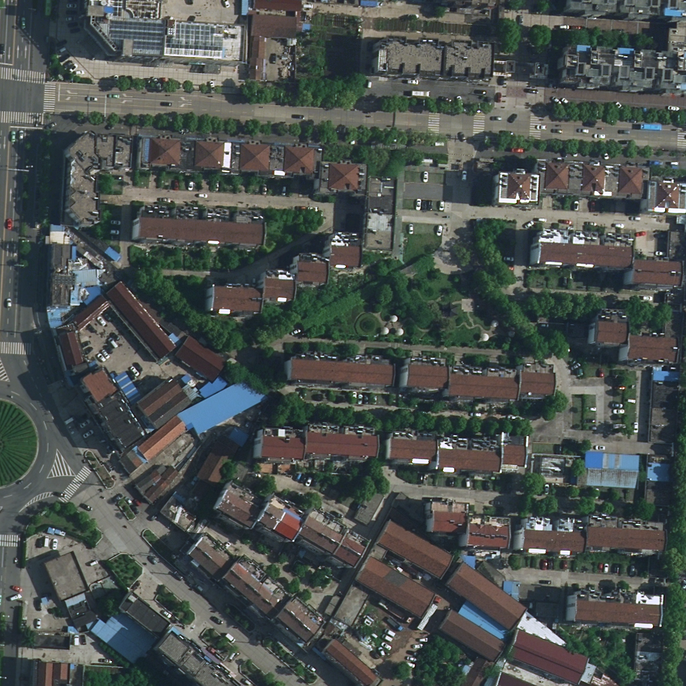
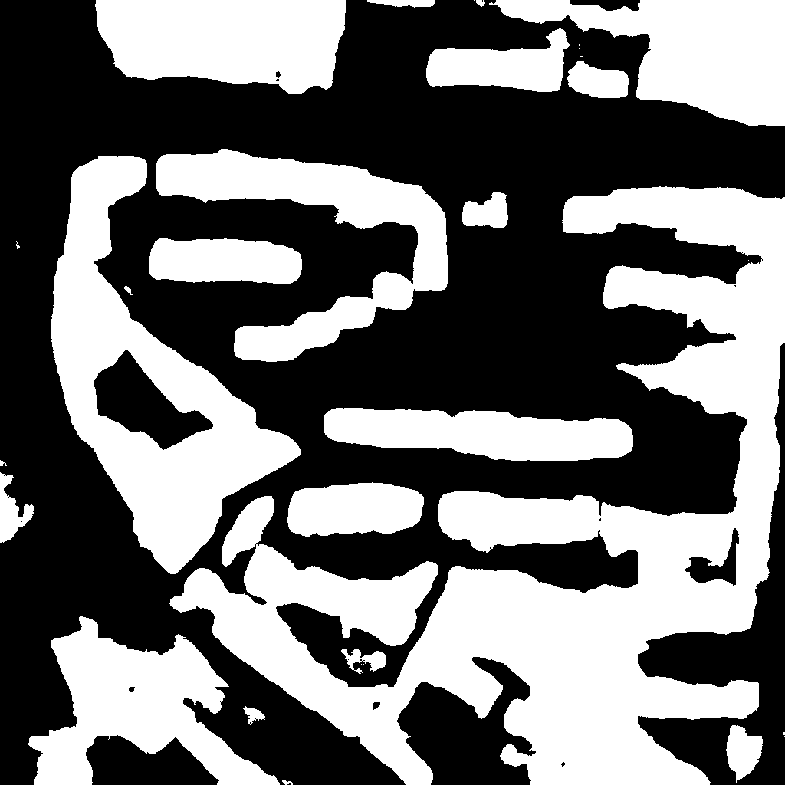
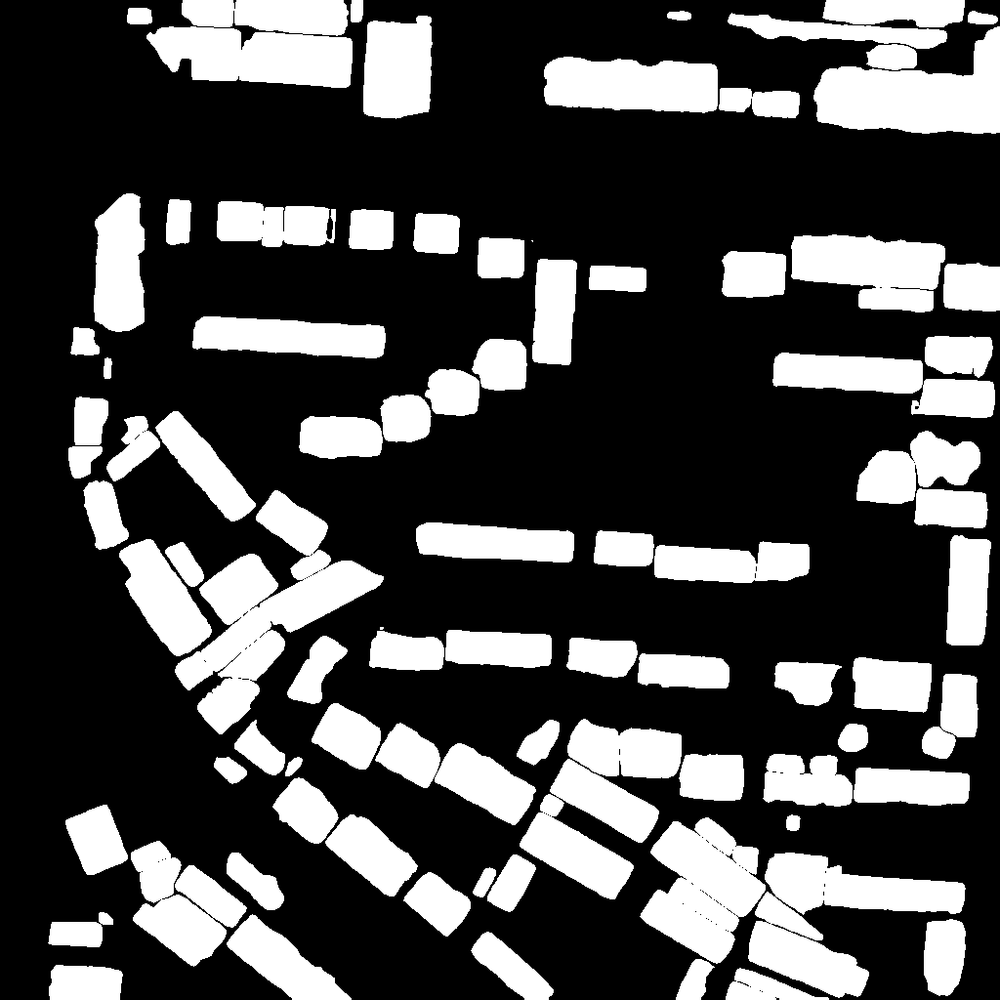
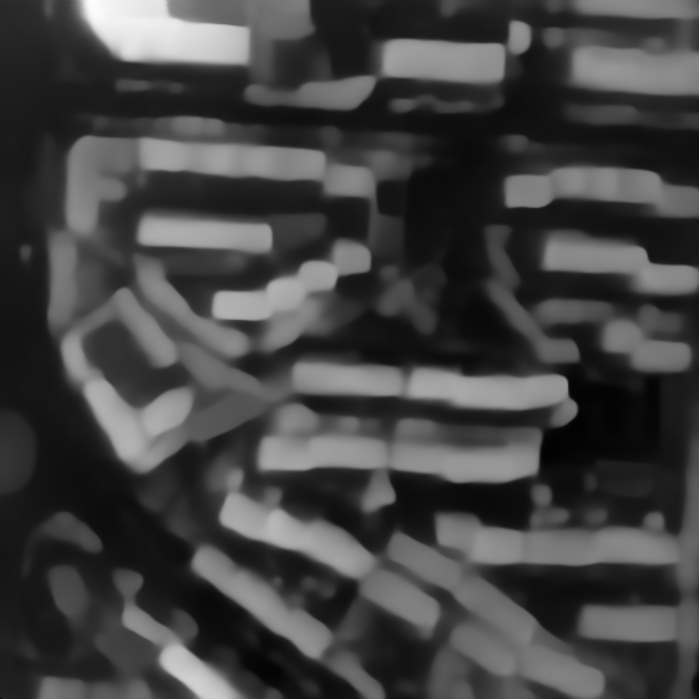
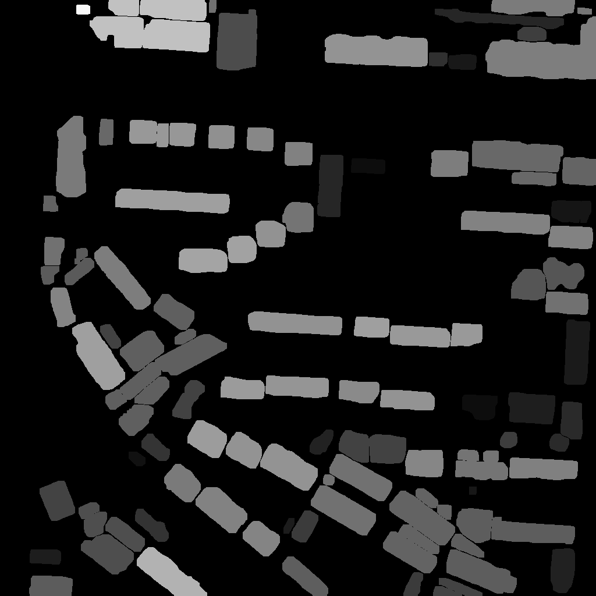
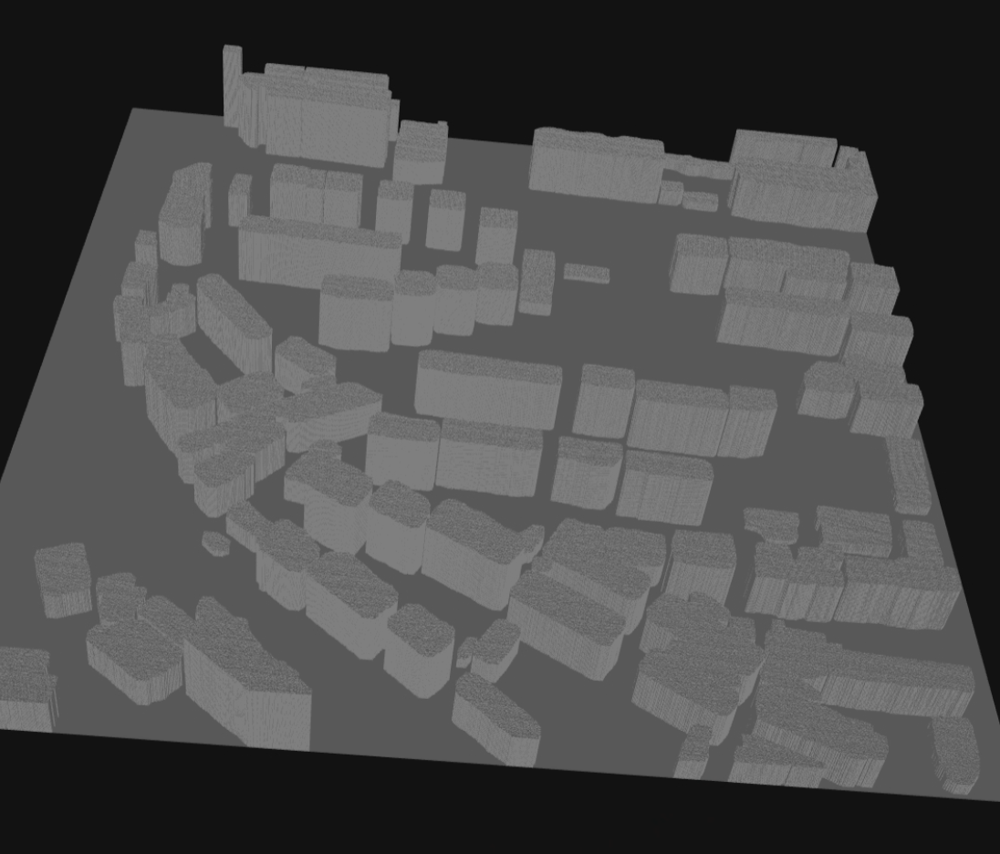
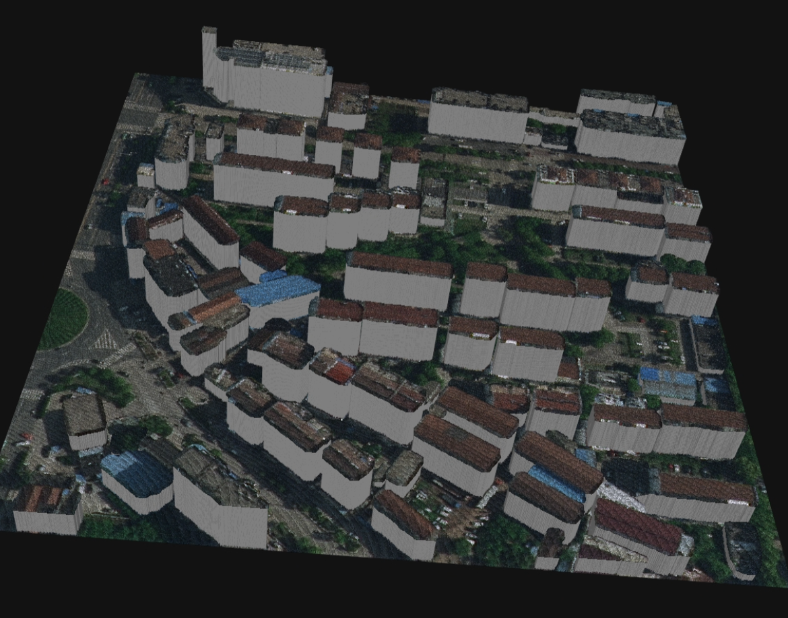

# City Recon

Reconstructing a 3D model from only one urban remote sensing image！

City Recon is a powerful tool designed for reconstructing cityscapes from aerial images. By combining cutting-edge depth estimation and segmentation models, this project allows you to create 3D models with and without texture.

## Overview

This project integrates multiple third-party tools to deliver high-quality results. Below is a quick guide on how to install the dependencies and use the tool.

<video width="640" height="360" controls autoplay loop>
  <source src="assets/teaser.mp4" type="video/mp4">
  Your browser does not support the video tag.
</video>

## Prerequisites

- Python 3.8
- Anaconda or Miniconda installed
- GPU with CUDA support
- CUDA-Toolkits installed in /usr/local/cuda (mmcv-full required) 

## Installation

### Step 1: Clone the Repository

Start by cloning the City Recon repository and its third-party dependencies:

```bash
git clone https://github.com/ZhongtaoWang/city_recon.git
cd city_recon

# Clone third-party dependencies
cd third_party
git clone https://github.com/LiheYoung/Depth-Anything.git  # may failed, can download manually
git clone https://github.com/UARK-AICV/AerialFormer.git
git clone https://github.com/SysCV/sam-hq.git
cd ..
```

### Step 2: Set Up the Environment

Create a new Python environment using Conda and install the required packages:

```bash
conda create --name city_recon python=3.8 -y
conda activate city_recon

# Install core dependencies
pip install -U openmim
pip install torch torchvision  opencv-python huggingface_hub matplotlib pycocotools opencv-python onnx onnxruntime timm
mim install mmcv-full  # it may take long time, if failed, try pip install mmcv-full
pip install mmsegmentation==0.30.0
pip install scikit-image scikit-learn scipy
```

### Step 3: Install Third-party Dependencies

Navigate to each third-party repository and install their dependencies:

#### SAM-HQ

```bash
cd third_party/sam-hq
pip install -e .
cd ../..
```

#### AerialFormer

```bash
cd third_party/AerialFormer/
pip install -v -e .
cd ../..
```

Finally, copy the `myrun.py` script to the `Depth-Anything` directory:

```bash
cp myrun.py third_party/Depth-Anything/
```


### Step 4: Download Pretrained Weights

You should download pretrained weights [here](https://disk.pku.edu.cn/link/AA92EA18A845364B819CB87E08002AB076), and unzip it in the root dir of this repo.

```bash
unzip weights.zip
```

---

## Usage

To run City Recon on an image, use the following command:

```bash
sh recon.sh /path/to/the/image
```

### Example

You can include a screenshot or sample image result here to showcase the output. For example:


```bash
sh recon.sh assets/3674.png
```



---

## Docker Usage 

You can use Docker to run the City Recon tool without setting up a Python environment or installing dependencies manually. Follow the instructions below to build the Docker image and run the container.

### Step 0: Preparation

Firstly, clone this repo and third-party dependencies.

```bash
git clone https://github.com/ZhongtaoWang/city_recon.git
cd city_recon


# Clone third-party dependencies
cd third_party
git clone https://github.com/LiheYoung/Depth-Anything.git # may failed, can download manually
git clone https://github.com/UARK-AICV/AerialFormer.git
git clone https://github.com/SysCV/sam-hq.git

```


You should download pretrained weights [here](https://disk.pku.edu.cn/link/AA92EA18A845364B819CB87E08002AB076), and unzip it in the root dir of this repo.

```bash
unzip weights.zip
```


### Step 1: Build the Docker Image

First, you need to build the Docker image from the `Dockerfile` provided in the repository. Make sure you are in the root directory of the project, then run the following command:

```bash
docker build -t city_recon .
```

This command will create a Docker image named `city_recon`.

### Step 2: Running the Docker Container with GPU

To process an image and generate the 3D model using Docker, you can run the container with the following command:

```bash

docker run --gpus all --rm -v /path/to/input_image.png:/app/input.png -v /path/to/output_folder:/app/workdir city_recon /app/input.png

```

#### Explanation:
- `--rm`: Automatically removes the container when it exits.
- `-v /path/to/input_image.png:/app/input.png`: Mounts the input image from your local system into the container.
- `-v /path/to/output_folder:/app/workdir`: Mounts the output directory from the container to your local system, where the results will be saved.
- `city_recon`: This is the name of the Docker image you built.
- `/app/input.png`: This is the input image path inside the container.

### Example

Suppose you have an image located at `./assets/3674.png` and you want to save the output to a folder called `./output`. You would run the following command:

```bash
docker run --gpus all --rm -v $(pwd)/assets/3674.png:/app/input.png -v $(pwd)/output:/app/workdir city_recon /app/input.png
```

### Step 3: Accessing the Results

After the container finishes processing, you will find the results in the `output` folder that you mounted in the previous step. The generated files include:

- **3D Model (no texture):** `workdir/ply/${image_name}.ply`
- **3D Model (with texture):** `workdir/ply/${image_name}_color.ply`
- **Intermediate Visualization Results:** `workdir/visualize/`

You can explore these files in your local directory.

### Using CPU (Not Recommend)

If your system does not have an NVIDIA GPU and you have installed the NVIDIA Container Toolkit, you can use cpu by the following scripts

```bash

docker run --rm -v /path/to/input_image.png:/app/input.png -v /path/to/output_folder:/app/workdir city_recon /app/input.png

```

This will enable CUDA support for faster processing.

---


## Results

The output files are saved as follows:

- **3D Model (no texture):** `workdir/ply/${image_name}.ply`
- **3D Model (with texture):** `workdir/ply/${image_name}_color.ply`
- **Intermediate Visualization Results:** `workdir/visualize/`

### Visualization Example

You can include a visualized example of the intermediate results here:















---

## License

MIT License
